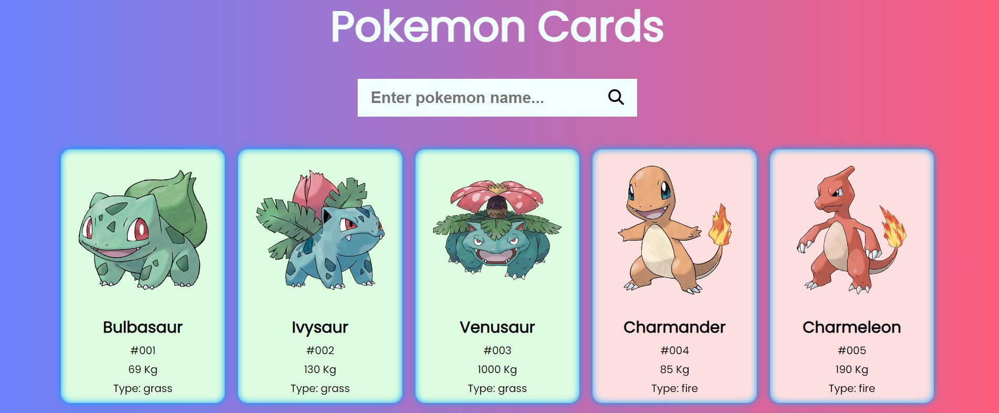
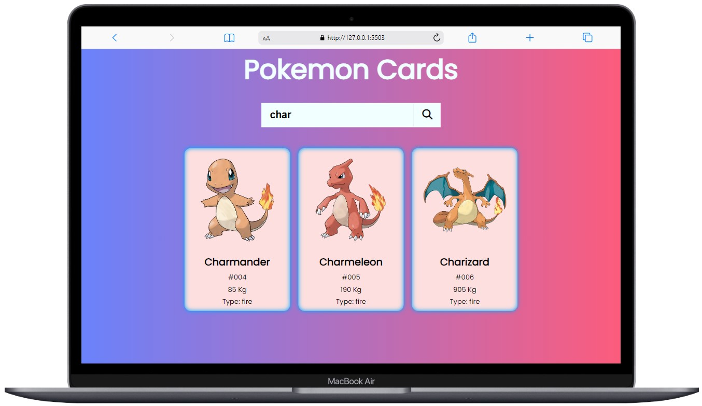
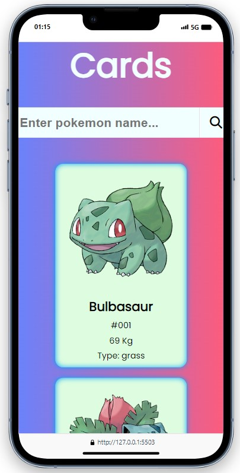

<!-- PROJECT LOGO -->
<br />
<div align="center" id="readme-top">
  <a href="#">
    
  </a>


# Pokémon Cards

This is a simple web application that displays Pokémon cards. Users can search for Pokémon by name, and the application will dynamically fetch and display the corresponding Pokémon information.

  <p align="center">
   If you want to revive your memories...
    <br />
    <a href="https://pokemon-app-nine-fawn.vercel.app/"><strong>LIVE »</strong></a>
    <br />
  </p>
</div>


## Getting Started

1. Clone this repository to your local machine:

    ```bash
    git clone https://github.com/Mehmet-github06/pokemon-cards.git
    ```

2. Open the project folder:

    ```bash
    cd pokemon-cards
    ```

3. Open the `index.html` file in your preferred web browser.

## Features

- Search for Pokémon by name.
- Dynamically fetch Pokémon information from the [PokéAPI](https://pokeapi.co/).
- Display Pokémon cards with their image, name, ID, weight, and type.

## Technologies Used

- HTML
- CSS
- JavaScript
- [Font Awesome](https://fontawesome.com/) for icons

## Usage

1. Type the name of a Pokémon in the search input.
2. Press the search button or hit Enter.
3. View the Pokémon card(s) displayed on the page.

## Screenshots





## Credits

- Pokémon data is fetched from the [PokéAPI](https://pokeapi.co/).
- Icons are provided by [Font Awesome](https://fontawesome.com/).


## On Mobile 📲
<div align="center" id="responsive" width="100%">
    <br>
    <br>
</div>